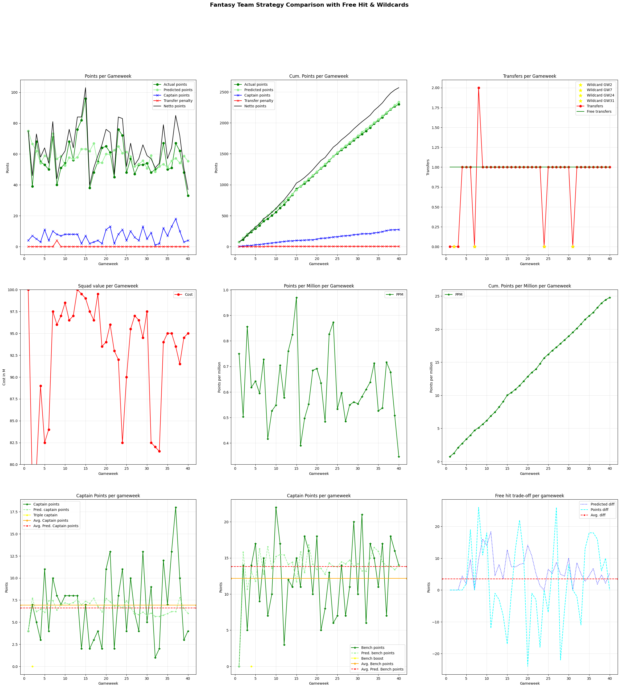

# The start of the AI-nderlecht

*A new season in the Jupiler Pro League will start next week. This means a new Fantasy Pro League season is also starting again.*

Last year, I started the game very well the first weeks, endings regularly in the top 100. In the pre-season, I already researched a bit about the use of Machine Learning or AI in Fantasy games.  
I came across [AIrsenal](https://www.turing.ac.uk/news/airsenal) and other attempts derived from this research. A particular Github project, [fpl-prediction by solpaul](https://github.com/solpaul/fpl-prediction/tree/61b25e5729e60bb7b507998ac608a5ffd6f3e523), gave me some ideas. However, I did not get any further last year than just some data fetching, cleaning and exploration.  

This year, I was excited to pick up this project and try to end in the top 10 (because there are some nice [prizes](https://fantasy.proleague.be/prizes) to win 🤪).

In this post, I will describe my approach and first results briefly.

## Data collection
I used some data sources to fetch data regarding the Fantasy Pro League.

**Transfermarkt**   
Fixtures and positions per gameweek.

**Fantasy Pro League**   
Last year's statistic / points where still accessible through an endpoint for each gameweek. (yey!) Unlucky, the stats before the 2024/25 season have been deleted.

**Myself**  
Giving a score (1-5) for the performance of each team indicating how well they perform at home or away, because on my gut feeling.

## Data cleaning
Some steps I did to clean up the fetched data from different resources:
- aligning team names
- encoding team names
- combining multiple seasons (24/25 and 25/26)
- rolling window features: last X games: scored points by the player, the team and his opponent per gameweek/player (total and per 90 minutes)
    where X is 1, 3, 5 and all previous games

These rolling window features indicate how well a player is performing the last X games or the current season.  
However, this could be a pitfal if calculated over multiple seasons (like it is now): a player could have a worse season after an excellent season, or the first game of the sesason which is probably could be worse, ...  
For now, it is sufficient as indicator of how well players are performing.

## Model training
As we want to know how well a player will be performing this week, we use the data of all games before gameweek X and use the data of gameweek X to test. This way, we can iterate from GW1 to GW40 to test the performance of the model when having more and more training data.

To be able to compare my 'main' model with a 'dumb' model, I created a simple model which 'predicts' the average points of this player's games.
This resulted in an average MAE of 2.7 for season 24/25. It improves slightly when having more data, but per gameweek it is an extra 200 records to be trained on, so that's still insufficient. 

This approach was also done for a random forest regressor and XGBoost. They perform almost equally good (MAE 2.1-2.4 and 2.2-2.6), but the RF has my preference.

My wish that adding the 25/26 and the following seasons' data will make this model perform better. 

## Selecting the right team
Now that we predicted the total number of points scored by each player for a gameweek, we should select a team, maximizing the total number of points, while the team still follows the following rules:
- within the budget of € 100 million
- 15 players: 2 goalkeepers, 5 defenders, 5 midfielders, 3 attackers
- valid starting formations: 
    3-4-3,
    3-5-2,
    4-3-3,
    4-4-2,
    4-5-1,
    5-3-2,
    5-4-1
- max 3 players of the same club

Since each team get a single transfer for free each gameweek and any additional transfer will result in losing 4 points per transfer. A transfer can be saved (max 3).
At the end of the summer and winter transfer window and after the regular competition, you can build your team again from scratch.

The goal is to maximize the predicted points, while minimizing the number of transfers (and thus transfer penalties). This is a LP problem, solved by using the Python library `pulp`.
From this team, we have to pick a starting team. This is done as follows:
- picking the lowest number needed for a position of players with the highest prediction: the highest GK, the 3 highest DEF, the 3 highest MID, the highest FWD
- picking the highest non-picked player, if his position is not yet completed

## Result
Using all the above steps to train the model and to pick a rule-compliant team for each gameweek, we can compare the team's predicted total points and their actual receive points. This way, we can compare our total scored points for the season 24/25 to the winners of that season to get an idea how well our model performed.

<figure>

<figcaption>Results of the FJPL model.</figcaption>
</figure>

From these result we can see that we scored around **2476** points, which wouldn't have resulted in a top 10 placement of last season (number 10 received 2553 points). 
Some interesting key figures:
- 0 transfer penaltys
- 15 points for the bench players on average
- 7 extra points for the captain on average

## Improvements
1. Take into account 'saving' transfers (min. threshold for prediction increase per transfer)
2. Try to maximize the starting line-up, while minimizing the bench value. Because now a lot of points are 'lost' on the bench. (This will be an issue when a player in the starting lineup did not play and gets subbed)
    - This has been tested by adding a constraint of maximum bench value. Setting this to 18, gets us to a new highscore of 2560 (without any boosters) and 2588 with boosters.
    - This is not an indicator, since in this case, we're using the boosters on the "ideal" moments, by the highest predicted gain (using a threshold):

<figure>

<figcaption>Results of the FJPL model, minimizing the bench value</figcaption>
</figure>

  
&nbsp;  
&nbsp;  

> See ya! 👋🏻

*This blog will be updated using a preview before the gameweek and a post-analysis after the gameweek ended.*